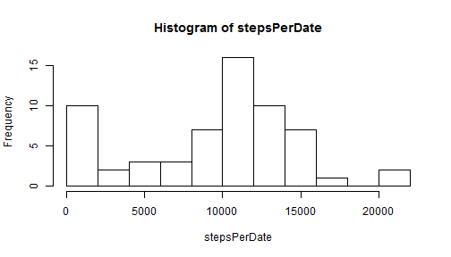
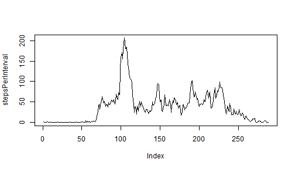
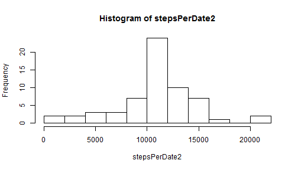
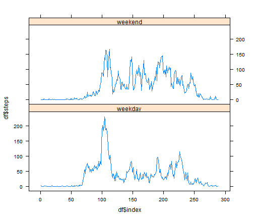

This is for RepData Peer Assessment 1. The following R code is used to set the global options

```r
library(knitr)
opts_chunk$set(echo=TRUE)
```

## Loading and preprocessing the data
The following code is used to load the data without further preprocessing rather than unzipping the file

```r
data <- read.csv(unz("activity.zip", "activity.csv"))
```

## What is mean total number of steps taken per day?
The total number of steps taken per day can be calculated as

```r
stepsPerDate <- tapply(data$steps, data$date, sum, na.rm=TRUE)
```

The following histogram shows the total number of steps taken per day

```r
hist(stepsPerDate, breaks=10)
```

 

Note that the plot was not beautified since it is not the purpose of this assignment.

The mean and median of the total number of steps taken per day can be calculated as 

```r
mean(stepsPerDate)
```

```
## [1] 9354.23
```

```r
median(stepsPerDate)
```

```
## [1] 10395
```
We could also inline text computation. The mean of the total number of steps taken per day is 9354.2295082 and the median of the total number of steps taken per day is 10395.

## What is the average daily activity pattern?
To understand the daily activity pattern, the steps per 5-min interval averaged acrodd all days are calculated as

```r
stepsPerInterval = tapply(data$steps, data$interval, mean, na.rm=TRUE)
```
This can be plotted as a time series

```r
plot(stepsPerInterval, type="l")
```

 

Note that the x-axis is the index of the 5-min interval of a day, not as coded in the original data. Also note the plot was not beautified for the same reason as stated for the histogram.

Which 5-minute interval, on average across all the days in the dataset, contains the maximum number of steps can be found out via 

```r
which.max(stepsPerInterval)
```

```
## 835 
## 104
```
The first number shows the time, i.e. 8:35 in that case, and the second number is simply the index.

## Imputing missing values
The are missing values in the dataset (NA) and the number of rows with missing values can be computed as

```r
sum(is.na(data$steps) | is.na(data$date) | is.na(data$interval))
```

```
## [1] 2304
```
Since there are no missing values in other two columns, it is sufficient to check the "steps" column.

To impute the missing values, there are many options. The assignment suggests to use the mean or median for that day, which was not chosen since the steps values are missing for all intervals of the first day. Instead the mean for the 5-min interval is used. The following code is used and the new dataset is named data2:

```r
data2=data
for (i in 1:nrow(data2)) { 
  if (is.na(data2$steps[[i]])) {
    idx=paste("", data2$interval[[i]], "", sep="")
    data2$steps[[i]]=round(stepsPerInterval[idx])
  }
}
```

The total number of steps taken per day is re-calculated, the histogram is re-plotted, and the mean and median total number of steps taken per pay are re-computed:

```r
stepsPerDate2 <- tapply(data2$steps, data2$date, sum, na.rm=TRUE)
hist(stepsPerDate2, breaks=10)
```

 

```r
mean(stepsPerDate2)
```

```
## [1] 10765.64
```

```r
median(stepsPerDate2)
```

```
## [1] 10762
```

All those values are changed from the first part of the assignment. It is expected that the histogram shape (the frequencies around mean/median are increased) is changed since the zero values are imputed. The mean values are expected to increase, since previous zero values are replaced with positive values. At the first thought one might not expect the median value changes a lot. However, the zero values can be replaced with (any, not small) positive values, the median value is also shifted, and in this case, higher values. That is, imputing missing values makes the estimates of the total daily number of steps larger.

## Are there differences in activity patterns between weekdays and weekends?
To facilitate the analysis, a factor (weekday/weekend) is added using the following code

```r
day <- character(length=nrow(data2))
for (i in 1:nrow(data2)) {
  whichday = weekdays(as.Date(data2$date[[i]]))
  if (whichday %in% c("Saturday", "Sunday"))
    day[[i]] = "weekend"
  else
    day[[i]] = "weekday"
}
day = factor(day)
data2$day = day
```

The data is subset as dataWeekday and dataWeekend. The steps per interval are calculated for each subset:

```r
dataWeekday = subset(data2, data2$day=="weekday")
dataWeekend = subset(data2, data2$day=="weekend")
stepsPerIntervalWeekday = tapply(dataWeekday$steps, dataWeekday$interval, mean)
stepsPerIntervalWeekend = tapply(dataWeekend$steps, dataWeekend$interval, mean)
```

The time series plots of the 5-min interval and the average number of steps taken during weekdays and weekends are as follows:

```r
df1 = data.frame(index=seq(1:nrow(stepsPerIntervalWeekday)), steps=stepsPerIntervalWeekday, day="weekday")
df2 = data.frame(index=seq(1:nrow(stepsPerIntervalWeekend)), steps=stepsPerIntervalWeekend, day="weekend")
df = rbind(df1, df2)
library(lattice)
xyplot(df$steps ~ df$index | df$day, type="l", layout=c(1,2))
```

 

Once can see that the 5-min interval activities spread out throughout the day and the dominant ativity around 8:05 is not that strong at the weekend, which are pretty much expected.
